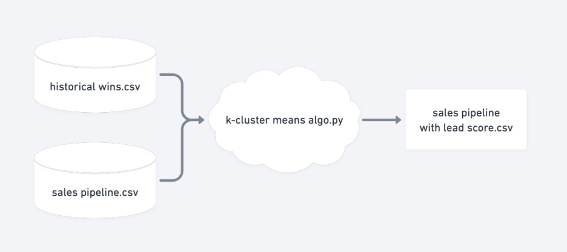
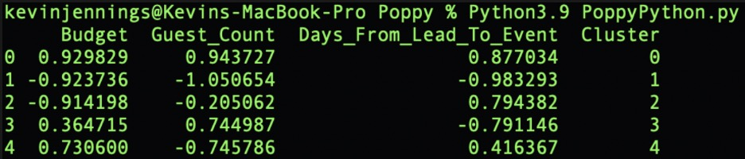

## Machine Learning Lead Scoring Tool 

__About__

ML lead scoring tool was created while consulting with a seed-level wedding flower startup. The CEO of the startup had an issue – she was receiving more leads than the sales team could process. Additionally, the leads were not all quality, leading to a low conversion rate. 

My solution to the problem was the develop a lead scoring algorithm which segmented leads based on historical wins. 

The Python program is designed to cluster historical wins into 5 different customer segments. Each customer is segmented using three data points:

1.	Budget
2.	Number of wedding guests
3.	Days until wedding

Once historical wins customer segments are established, the program inserts a lead, one at a time, and reruns the clustering algorithm to group the lead into one of five clusters. Leads are then printed on a new excel spreadsheet with their corresponding Deal ID, parameters, and cluster number. 

__Program Flow__

Program takes historical wins spreadsheet and sales pipeline spreadsheet as inputs, and outputs a third spreadsheet with corresponding clusters.

__Interpreting Clusters__

In the above text box, the cluster number is y-axis and the customer parameters are the x-axis. The numbers corresponding to each cell are the average number corresponding to each cluster, with an average of 1 and standard deviation of 0 for each. To further clarify, each number is on a scale from -1 to 1. Given this, segment 0 represents a customer segment with the highest budget, guest count, and days to the wedding. Segment 4 represents a customer segment with a high willingness to pay for a smaller guest count. 

__Code__

*Link to [GitHub](https://github.com/kevjen37/LeadScoringML/blob/main/Leads.py)*

