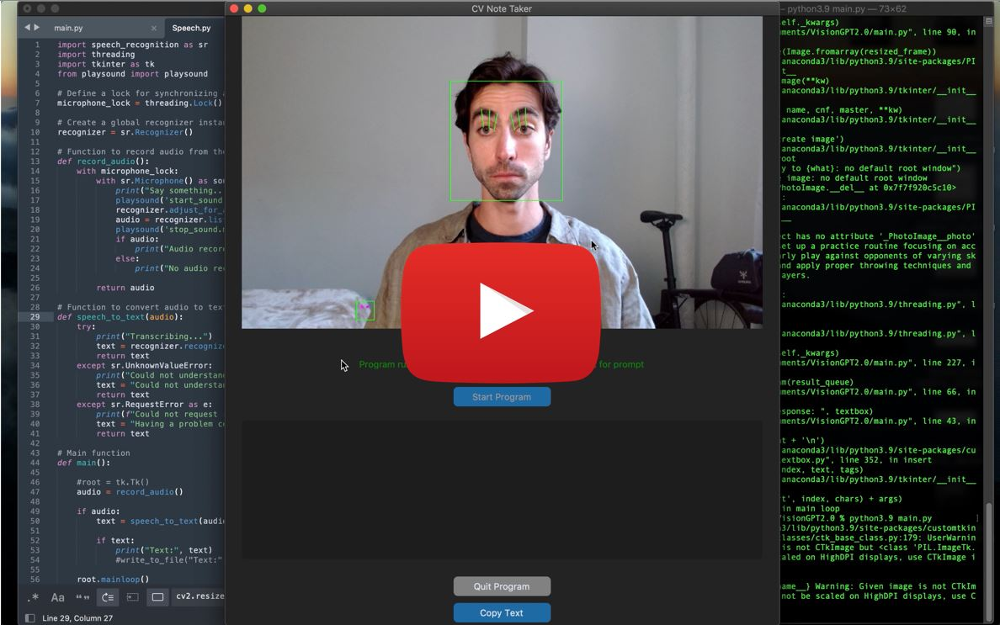

## BrowPrompt for Hands-Free Prompting

_Click for demo_

__🤔 The Problem: Why I Built BrowPrompt__

_Is it just me, or is something left to be desired in how we interface with generative AI?_

Throughout my day, I routinely consult language models for answers. However, I have not found an effective way to access these tools without:
1. constantly navigating to a web app; sifting through all my tabs, only to find that I've been automatically logged out.
2. having my microphone always on and listening: "Hey Siri!" — Even though consumers have resigned to having applications always listening, it is hard to believe this is the preferred status quo.

As AI becomes a more useful copilot, I am interested in holistically exploring new ways to interact with it. This inspired me to develop BrowPrompt, a solution designed to streamline this process with a unique approach. 

__💡 The Solution: Exploring Applications of Computer Vision for Improved Interaction__

_What if your facial expression could be used to identify when you are prompting an AI model?_

Using facial expressions as a trigger enables hands-free interaction with the model, eliminating the need to type a prompt, press a button, or use a vocal command like "Hey Siri."

BrowPrompt, my computer vision-based prototype, leverages an eyebrow raise lasting over two seconds to trigger AI-prompting. This facial cue is simple yet deliberate, minimizing false positives since extended eyebrow raises are uncommon in regular activities.

Here’s how it works:
- Facial Cue Detection: BrowPrompt continuously monitors your face for an extended eyebrow raise, ensuring that the microphone activates only when you intend to use it.
- Voice-to-Text Auomation: Upon detecting the eyebrow raise, BrowPrompt turns on your microphone to capture your query. Captured audio is then passed through Google's Web Speech API to be converted to text.
- Prompting GPT-4o: The converted text is fed directly to GPT-4o via OpenAI's API, which returns the model's response both in text and through OpenAI's text-to-speech (TTS-1) model.

__🚀 User Benefits:__ 

- Hands-Free Operation: Easily prompt GPT-4 with just an eyebrow raise, keeping your hands free for other tasks.
- Enhanced Privacy: By monitoring facial cues instead of always listening, BrowPrompt respects your privacy while remaining readily accessible.
- Low Overhead: BrowPrompt can run in the background, providing quick access to information without the need for constant manual input.

__👨‍🏫 How to Use:__

1. User sets the sliding scale to calibrate the distance from their face to the camera (can be changed while the program is running).
2. When the program detects a brow raise longer than 2 seconds, it will play an audible ping and the user can begin dictating their prompt.
3. User can choose to copy response generated in the text box using the "Copy Text" button.

__💻 Tech Specs:__ 

__Technologies Used:__
- Programming Languages: Python for the backend logic and a custom Python tkinter library (customtkinter) for the frontend interface.
- Frameworks and Libraries:
  - OpenCV cv2 library for facial recognition, including pre-trained Haarcascade classifier used to detect faces in real-time.
  - PIL to convert BGR format (used by OpenCV) to RGB format that can be displayed by Tkinter.
  - dlib for facial landmark detection, including landmarks around the eyes and eyebrows which I use to calculate vector distance.
- APIs and Services: OpenAI API for GPT-4o interactions and Google Web Speech API for voice-to-text conversion.

~~~python
# Draw rectangles around the detected faces
for (x, y, w, h) in faces:
  cv2.rectangle(frame, (x, y), (x+w, y+h), (0, 255, 0), 2)
  # Converting the OpenCV rectangle coordinates to Dlib rectangle
  dlib_rect = dlib.rectangle(int(x), int(y), int(x+w), int(y+h))
  # Detecting landmarks
  detected_landmarks = predictor(frame, dlib_rect).parts()
  # Converting to np matrix
  landmarks = np.array([[p.x, p.y] for p in detected_landmarks])
  #logic to measure distance between eyes and eye brows
  LE_1 = np.linalg.norm(landmarks[39] - landmarks[21])
  LE_2 = np.linalg.norm(landmarks[38] - landmarks[20])
  LE_3 = np.linalg.norm(landmarks[37] - landmarks[19])
  RE_1 = np.linalg.norm(landmarks[42] - landmarks[22])
  RE_2 = np.linalg.norm(landmarks[43] - landmarks[23])
  RE_3 = np.linalg.norm(landmarks[44] - landmarks[24])
~~~
_code block shows how OpenCV, dlib, and NumPy interact: OpenCV detects faces, while dlib converts into a format suitable for landmark detection. The dlib predictor identifies key facial landmarks, which are converted into a NumPy array for easier manipulation. The code then calculates the Euclidean distances between specific eye and eyebrow landmarks to determine if the eyebrows are raised, leading to microphone trigger event_

__Architecture and Design:__
- System Architecture: The system consists of a front-end interface for user interaction, a backend server that handles facial recognition and voice processing, and integration with external APIs for AI responses.
- Design Patterns: Used MVC architecture for modularity and scalability, including a multithreaded approach for API calls to keep the application responsive.

__Roadmap:__
- Dynamic Vector Setpoint: Current implementation calculates distance between 6 vectors connecting the eyes and eyebrows in order to identify a brow raise. The frontend contains a slider for the user to set a static threshold, which the program uses to constitute a brow raise. This can lead to false positives and miscalculations as the user shifts positions away from the camera. To improve this, I am working to program a dynamic setpoint that changes using the users other facial features as a benchmark.
- Latency: There is room for improvements with latency as the program relies on multiple API calls. Tests to be conducted to identify bottlenecks in cycle time, including testing time of API calls and speed of alternative TTS, voice-to-text, and GPT models.

