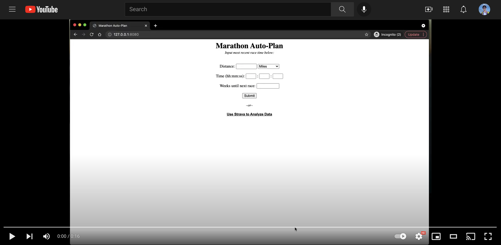

## Marathon Training Plan Generator

_Click for demo_

Python web application designed to provide athletes with a 4-week cycle marathon training plan using either their most recent race time or Strava data. 

Application is developed using Python 3.9 for the backend, Flask for the web framework, and HTML/CSS for the front end. 

## Vo2 Max and Pacing Calculations:

Application calculates Vo2 max (maximum volumetric oxygen consumption per minute) using a reliable recent race time. This is possible by first calculating the athletes velocity, then inputting time and velocity into the "Drop Dead Formala", and "Oygen Uptake Formula", respectively.

With a Vo2 max calculated, it is then possible to "curve-fit" athletes into a standard measurement unit, reagrdless of race distance. 

From there, an athletes paces are calculated as a percentage of Vo2 max.

## Strava API integration:

Athletes have the option of authorizing the use of their data to be used to calculate their Vo2 max. 

This is acheived through Strava's API by authenticating a user, receiving their access token, swapping their access token for a read_all token, and storing that correlated refresh token.

Once an athlete's data is recieved, all run activities are iterated over, comparing every possible segment of 5k length or greater and calculating the correlated Vo2 max. Once the largest Vo2 max is identified, it is saved and used to calculate the athletes paces and running program